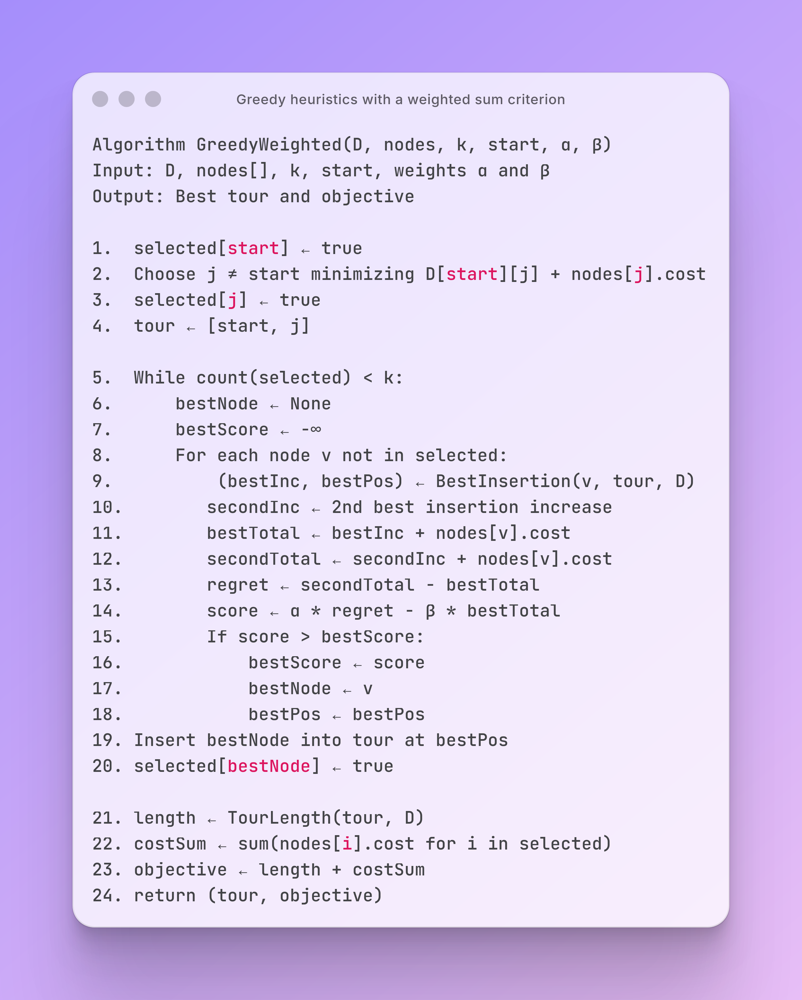
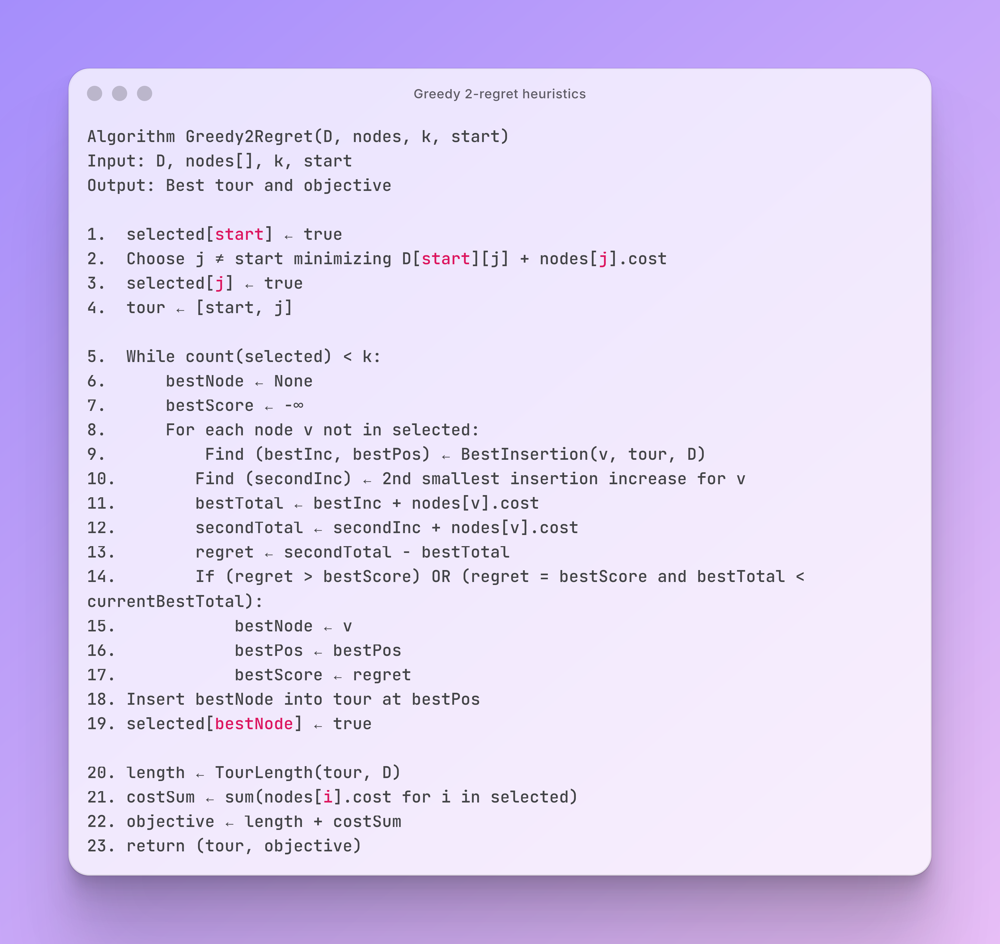
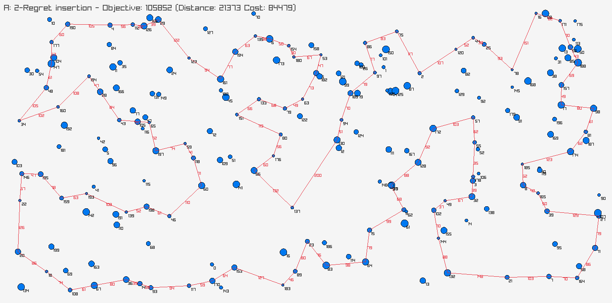
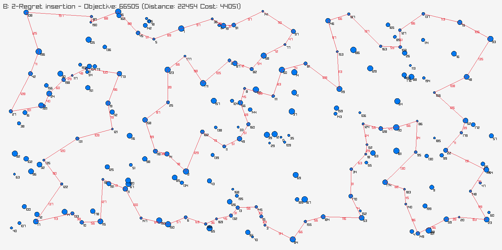

_Link to the source code: [GitHub Repository](https://github.com/wojbog/evolutionary_computation)_

# Problem Description
The problem considered in this project involves a set of nodes, each represented by three
integer values: two coordinates (x,y)(x, y)(x,y) that define the node’s position in a
two-dimensional plane, and a cost value associated with the node. The objective is to select
exactly 50% of all available nodes (if the total number of nodes is odd, the number of
selected nodes is rounded up) and construct a Hamiltonian cycle — that is, a closed path
visiting each selected node exactly once and returning to the starting node.
The goal is to minimize the sum of two components:
1. The total length of the constructed cycle, and
2. The total cost of all selected nodes
The distances between nodes are calculated using the Euclidean metric, rounded to the
nearest integer.

# Implemented Algorithms
## Greedy Heuristics with a Weighted Sum Criterion

## 2-Regret Insertion Heuristic

# Results

## Instance A
| Method                        | Best | Worst | Average |
|-------------------------------|:----:|:-----:|:-------:|
| 2-Regret Insertion            | 105852     | 123428      |  115474.93       |
| Weighted Sum (α=1.00, β=1.00) | 71108     |  73438     |   72130.85      |

## Instance B
| Method                        | Best | Worst | Average |
|-------------------------------|:----:|:-----:|:-------:|
| 2-Regret Insertion            | 66505    | 77072      |  72454.77       |
| Weighted Sum (α=1.00, β=1.00) | 47144     |  55700     |   50918.82      |

## Best path for the instance A
.png)

## Best path for the instance B
.png)

# Comparison
## Instance A
| Algorithm                                | Total Distance | Total Cost   | Objective Value |
|------------------------------------------|:--------------:|:----------:|:-----------------:|
| 2-Regret Insertion                       |       21373    |  84479       |         **105852**  |
|           Weighted Sum (α=1.00, β=1.00)  |     22981      | 48127        |  **71108**          |
| NN - End                                 |  -              |     -         |   89198                |
| NN - Anywhere                                 |    -            |   -           |   71488                |
| Greedy Cycle                                 |   -             |   -           |    72639               |

## Instance B
| Algorithm                                | Total Distance | Total Cost   | Objective Value |
|------------------------------------------|:----------------:|:--------------:|:-----------------:|
| 2-Regret Insertion                       |     22454      | 44051        |    **66505**        |
|           Weighted Sum (α=1.00, β=1.00)  |    21152       | 25992        |  **47144**          |
| NN - End                                 |      -          |   -           |    62606               |
| NN - Anywhere                                 |     -           |     -         |     49001              |
| Greedy Cycle                                 |     -           |     -         |    50243               |

# Conclusions

Among the four implemented heuristics, the Weighted Greedy (2-Regret + Cost) method achieved the best overall performance, producing the lowest objective values and the most consistent results across runs. The 2-Regret heuristic also performed well, showing a good balance between exploration and exploitation, while the simpler Nearest and Best Insertion methods were faster and often yielded beter solutions. Overall, incorporating regret and weighted selection significantly improved solution quality and stability compared to purely local greedy approaches.