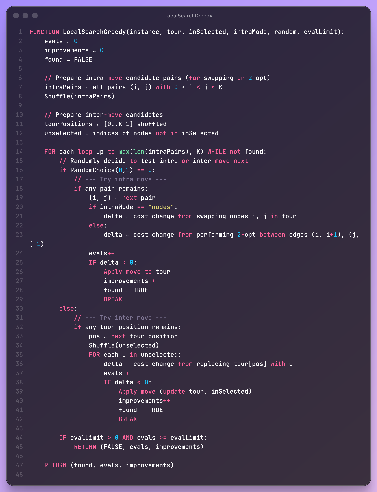
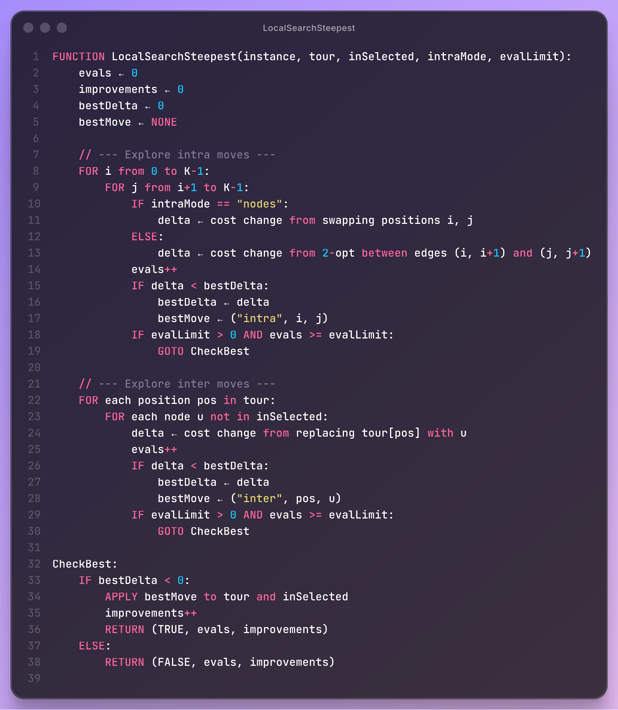
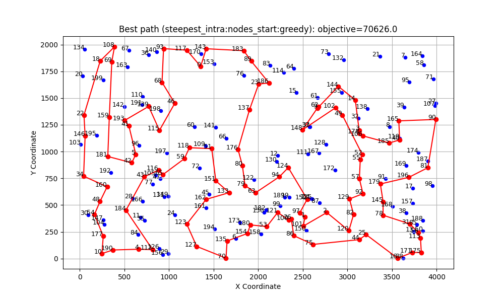

_Link to the source code: [GitHub Repository](https://github.com/wojbog/evolutionary_computation)_

# Authors
- Wojciech Bogacz 156034
- Krzysztof Skrobała 156039

# Problem Description
The problem considered in this project involves a set of nodes, each represented by three
integer values: two coordinates (x,y)(x, y)(x,y) that define the node’s position in a
two-dimensional plane, and a cost value associated with the node. The objective is to select
exactly 50% of all available nodes (if the total number of nodes is odd, the number of
selected nodes is rounded up) and construct a Hamiltonian cycle — that is, a closed path
visiting each selected node exactly once and returning to the starting node.
The goal is to minimize the sum of two components:
1. The total length of the constructed cycle, and
2. The total cost of all selected nodes
The distances between nodes are calculated using the Euclidean metric, rounded to the
nearest integer.

# Implemented Algorithms
## Local Search Greedy

## Local Search Steepest

# Results

## Comparison of previous methods results

### Instance A
| Method                        | Best | Worst | Average |
|-------------------------------|:----:|:-----:|:-------:|
| random                        | 235308     | 292123      |  264677.17    |
| nn_end                        | 89198     |  123123     |   104012.785      |
| nn_anywhere                   | 71488     | 74410      |  72635.72    |
| greedy cycle                  | 72639     |  72639     |   72639.0      |
| 2-Regret Insertion            | 105852     | 123428      |  115474.93    |
| Weighted Sum (α=1.00, β=1.00) | 71108     |  73438     |   72130.85      |

### Instance B
| Method                        | Best | Worst | Average |
|-------------------------------|:----:|:-----:|:-------:|
| random                        | 193234     | 234798      |  214279.235    |
| nn_end                        | 62606     |  77453     |   69764.43      |
| nn_anywhere                   | 49001     | 57324      |  51400.905    |
| greedy cycle                  | 50243     |  50243     |   50243.0      |
| 2-Regret Insertion            | 66505    | 77072      |  72454.77       |
| Weighted Sum (α=1.00, β=1.00) | 47144     |  55700     |   50918.82      |

## Local Search results

### Instance A

| Method  | best | worst | average|
|----------|----:|:-------:|:---------:|
|greedy_intra:edges_start:greedy    |70663|72648|71594.055  |46178 | 55471 | 50172.67 |
|greedy_intra:edges_start:random    |71564|76328|73528.81   |45537 | 51687 | 48154.865|
|greedy_intra:nodes_start:greedy    |70687|73027|71739.395  |46373 | 55385 | 50347.525|
|greedy_intra:nodes_start:random    |79677|99035|86909.13   |53417 | 71474 | 61453.295|
|steepest_intra:edges_start:greedy  |70510|72614|71463.08   |45867 | 54814 | 49907.205|
|steepest_intra:edges_start:random  |71246|78153|73699.995  |45903 | 51416 | 48195.845|
|steepest_intra:nodes_start:greedy  |70626|73004|71615.93   |46371 | 55385 | 50201.47 |
|steepest_intra:nodes_start:random  |81322|95342|87939.335  |55686 | 71546 | 62955.885|

### Instance B

| Method  | best | worst | average|
|----------|----:|:-------:|:---------:|
|greedy_intra:edges_start:greedy    |46178 | 55471 | 50172.67 |
|greedy_intra:edges_start:random    |45537 | 51687 | 48154.865|
|greedy_intra:nodes_start:greedy    |46373 | 55385 | 50347.525|
|greedy_intra:nodes_start:random    |53417 | 71474 | 61453.295|
|steepest_intra:edges_start:greedy  |45867 | 54814 | 49907.205|
|steepest_intra:edges_start:random  |45903 | 51416 | 48195.845|
|steepest_intra:nodes_start:greedy  |46371 | 55385 | 50201.47 |
|steepest_intra:nodes_start:random  |55686 | 71546 | 62955.885|

## Best path for the instance A

## Best path for the instance B

# Time

## Instance A

| Method  | min | max | average|
|----------|----:|:-------:|:---------:|
|greedy_intra:edges_start:greedy     |0.00  |0.006  |0.003 |
|greedy_intra:edges_start:random     |0.062 |0.099  |0.080 |
|greedy_intra:nodes_start:greedy     |0.000 |0.005  |0.002 |
|greedy_intra:nodes_start:random     |0.066 |0.118  |0.085 |
|steepest_intra:edges_start:greedy   |0.001 |0.005  |0.002 |
|steepest_intra:edges_start:random   |0.039 |0.050  |0.045 |
|steepest_intra:nodes_start:greedy   |0.000 |0.005  |0.002 |
|steepest_intra:nodes_start:random   |0.049 |0.142  |0.071 |

## Instance B

| Method  | min | max | average|
|----------|----:|:-------:|:---------:|
|greedy_intra:edges_start:greedy     |0.0    |0.01    |0.004|
|greedy_intra:edges_start:random     |0.064  |0.102   |0.081|
|greedy_intra:nodes_start:greedy     |0.0    |0.007   |0.003|
|greedy_intra:nodes_start:random     |0.058  |0.107   |0.082|
|steepest_intra:edges_start:greedy   |0.001  |0.01    |0.004|
|steepest_intra:edges_start:random   |0.038  |0.054   |0.045|
|steepest_intra:nodes_start:greedy   |0.001  |0.007   |0.004|
|steepest_intra:nodes_start:random   |0.048  |0.086   |0.063|

# Conclusions

The conducted experiments demonstrated that both the Greedy and Steepest local search algorithms effectively improved solutions for the node selection and Hamiltonian cycle optimization problem, outperforming baseline heuristics such as random, nearest neighbor, and insertion methods. Among the tested variants, approaches starting from greedy-based initial solutions consistently yielded better and more stable results compared to random starts, while the steepest variant occasionally achieved marginally better outcomes at the cost of slightly higher computation time. The methods proved highly efficient, with execution times in the millisecond range, and achieved significant reductions in total cost for both instances A and B. Overall, local search proved to be a robust and efficient optimization strategy, and future work could focus on integrating metaheuristic or hybrid approaches to further enhance solution quality and avoid local minima.