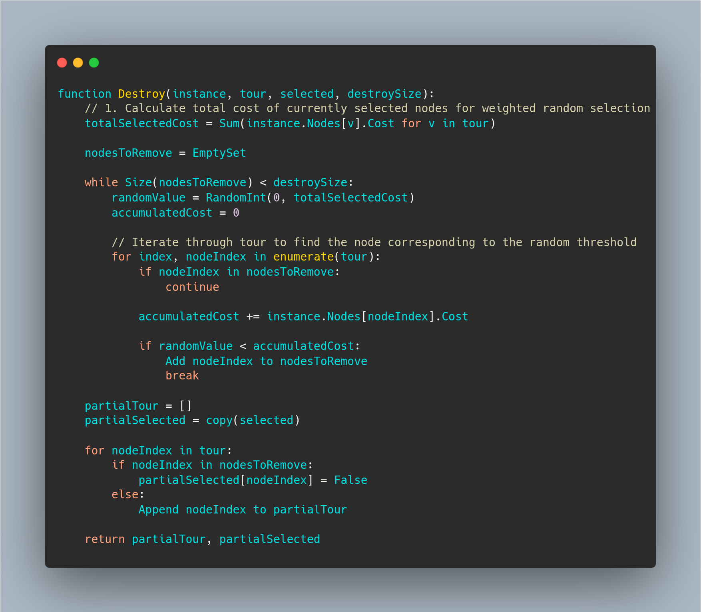
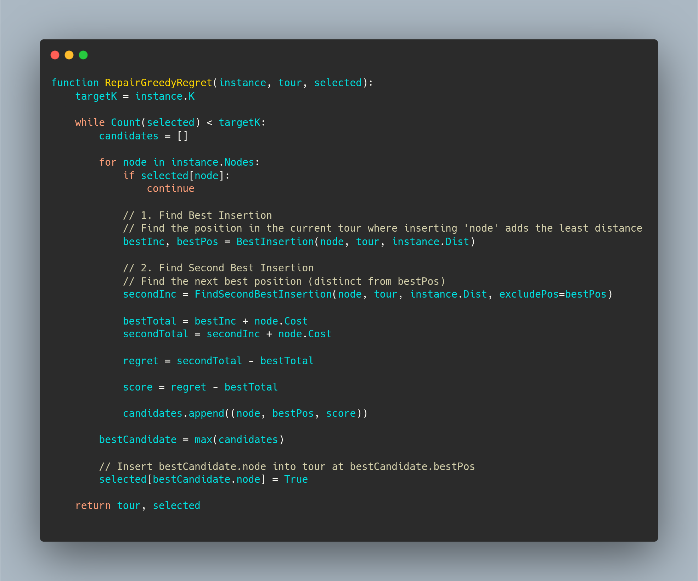
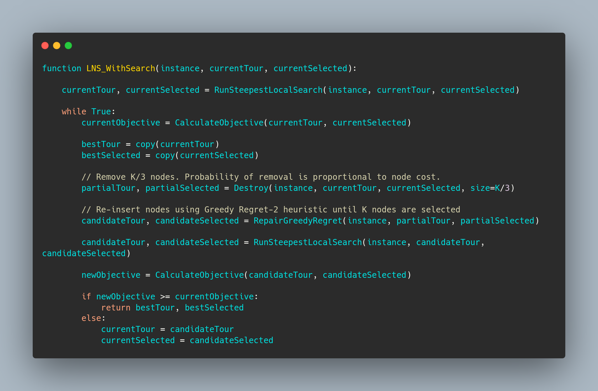
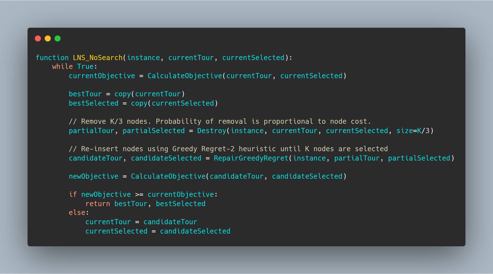
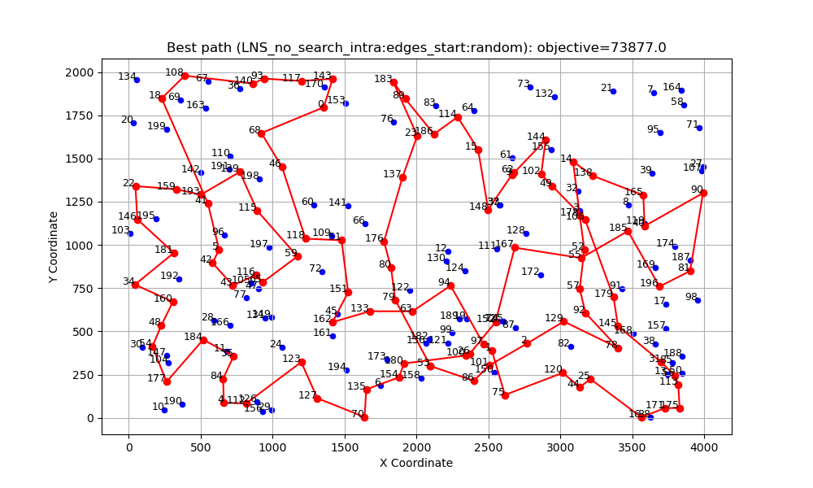
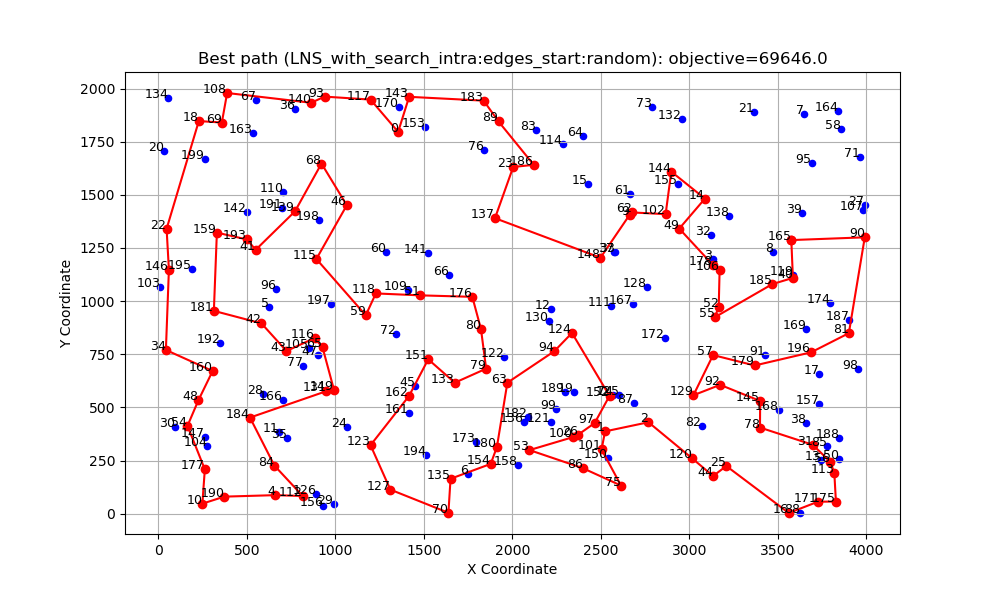
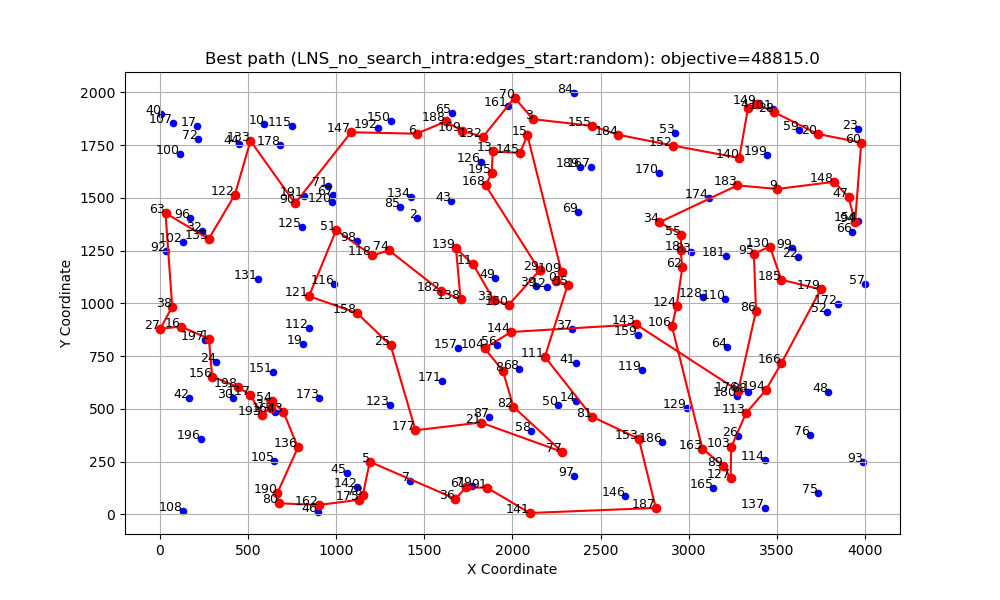
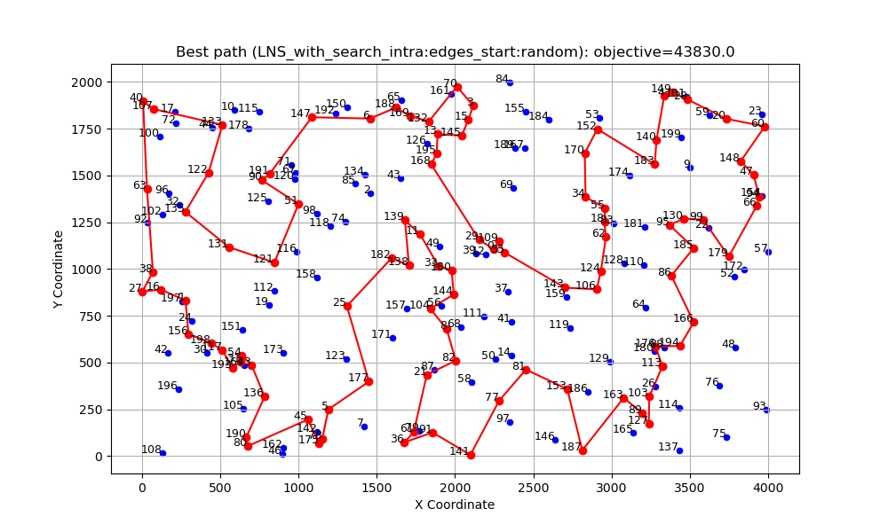

_Link to the source code: [GitHub Repository](https://github.com/wojbog/evolutionary_computation)_

# Authors
- Wojciech Bogacz 156034
- Krzysztof Skrobała 156039

# Problem Description
The problem considered in this project involves a set of nodes, each represented by three
integer values: two coordinates (x,y)(x, y)(x,y) that define the node’s position in a
two-dimensional plane, and a cost value associated with the node. The objective is to select
exactly 50% of all available nodes (if the total number of nodes is odd, the number of
selected nodes is rounded up) and construct a Hamiltonian cycle — that is, a closed path
visiting each selected node exactly once and returning to the starting node.
The goal is to minimize the sum of two components:
1. The total length of the constructed cycle, and
2. The total cost of all selected nodes
The distances between nodes are calculated using the Euclidean metric, rounded to the
nearest integer.

# Implemented Algorithms

# Results

## Comparison of previous methods results

### Instance A
| Method                        | Best | Worst | Average |
|-------------------------------|:----:|:-----:|:-------:|
| random                        | 235308     | 292123      |  264677.17    |
| nn_end                        | 89198     |  123123     |   104012.785      |
| nn_anywhere                   | 71488     | 74410      |  72635.72    |
| greedy cycle                  | 72639     |  72639     |   72639.0      |
| 2-Regret Insertion            | 105852     | 123428      |  115474.93    |
| Weighted Sum (α=1.00, β=1.00) | 71108     |  73438     |   72130.85      |
|greedy_intra:edges_start:greedy    |70663|72648|71594.055 |
|greedy_intra:edges_start:random    |71564|76328|73528.81  |
|greedy_intra:nodes_start:greedy    |70687|73027|71739.395 |
|greedy_intra:nodes_start:random    |79677|99035|86909.13  |
|steepest_intra:edges_start:greedy  |70510|72614|71463.08  |
|steepest_intra:edges_start:random  |71246|78153|73699.995 |
|steepest_intra:nodes_start:greedy  |70626|73004|71615.93  |
|steepest_intra:nodes_start:random  |81322|95342|87939.335 |
|steepest_intra:edges_start:random**  |71246|78153|73699.995 |
|steepest_intra:edges_start:random with Cand mech. |73076 |85487 |77866.91 |
|steepest_lm_intra:edges_start:random|71265 | 78247 | 73856.275|
|ILS_intra:edges_start:random |70135 | 72831 |71094.05|
|steepest_multi_start_intra:edges_start:random| 70518 |72995|71665.45|

### New Methods Results

| Method  | best | worst | average|
|----------|----:|:-------:|:---------:|
|LNS_no_search_intra:edges_start:random|73877|100946|81003.805|
|LNS_with_search_intra:edges_start:random|69646|72165|70830.13|

### Number of main loops iterations

| Method  | best | worst | average|
|----------|----:|:-------:|:---------:|
|LNS_no_search_intra:edges_start:random|5|31|17.97|
|LNS_with_search_intra:edges_start:random|1|7|2.8|

## Instance B
| Method                        | Best | Worst | Average |
|-------------------------------|:----:|:-----:|:-------:|
| random                        | 193234     | 234798      |  214279.235    |
| nn_end                        | 62606     |  77453     |   69764.43      |
| nn_anywhere                   | 49001     | 57324      |  51400.905    |
| greedy cycle                  | 50243     |  50243     |   50243.0      |
| 2-Regret Insertion            | 66505    | 77072      |  72454.77       |
| Weighted Sum (α=1.00, β=1.00) | 47144     |  55700     |   50918.82      |
|greedy_intra:edges_start:greedy    |46178 | 55471 | 50172.67 |
|greedy_intra:edges_start:random    |45537 | 51687 | 48154.865|
|greedy_intra:nodes_start:greedy    |46373 | 55385 | 50347.525|
|greedy_intra:nodes_start:random    |53417 | 71474 | 61453.295|
|steepest_intra:edges_start:greedy  |45867 | 54814 | 49907.205|
|steepest_intra:edges_start:random  |45903 | 51416 | 48195.845|
|steepest_intra:nodes_start:greedy  |46371 | 55385 | 50201.47 |
|steepest_intra:nodes_start:random  |55686 | 71546 | 62955.885|
|steepest_intra:edges_start:random |45903 | 51416 | 48195.845|
|steepest_intra:edges_start:random with Cand. Mech. | 45798 | 52670 | 48474.64 |
|steepest_lm_intra:edges_start:random|45941 | 51587 |48214.715 |
|ILS_intra:edges_start:random|45250|46331|45749.15|
|steepest_multi_start_intra:edges_start:random|46272|51158|48124.05|

### New Methods Results

| Method  | best | worst | average|
|----------|----:|:-------:|:---------:|
|LNS_no_search_intra:edges_start:random|48815|72910|57516.195|
|LNS_with_search_intra:edges_start:random|43830|48594|45299.75|

### Number of main loops iterations

| Method  | best | worst | average|
|----------|----:|:-------:|:---------:|
|LNS_no_search_intra:edges_start:random|7|33|17.485|
|LNS_with_search_intra:edges_start:random|1|7|2.92|

# Paths visualization
## Instance A

### LNS without local search variant

### LNS with local search variant

## Instance B

### LNS without local search variant

### LNS with local search variant

# Time

## Instance A

| Method  | min | max | average|
|----------|----:|:-------:|:---------:|
|greedy_intra:edges_start:greedy     |0.00  |0.006  |0.003 |
|greedy_intra:edges_start:random     |0.062 |0.099  |0.080 |
|greedy_intra:nodes_start:greedy     |0.000 |0.005  |0.002 |
|greedy_intra:nodes_start:random     |0.066 |0.118  |0.085 |
|steepest_intra:edges_start:greedy   |0.001 |0.005  |0.002 |
|steepest_intra:nodes_start:greedy   |0.000 |0.005  |0.002 |
|steepest_intra:nodes_start:random   |0.049 |0.142  |0.071 |
|steepest_intra:edges_start:random   |0.039 |0.050  |0.045 |
|steepest_intra:edges_start:random with Can. Mech. |0.008 |0.019 |0.011 |
|steepest_lm_intra:edges_start:random|0.025|0.049|0.030|
|ILS_intra:edges_start:random|0.053|0.297|0.09|
|steepest_multi_start_intra:edges_start:random|10.296|10.524|10.406|

### New Methods Results

| Method  | min | max | average|
|----------|----:|:-------:|:---------:|
|LNS_no_search_intra:edges_start:random|0.023|0.19|0.09|
|LNS_with_search_intra:edges_start:random|0.032|0.082|0.048|

## Instance B

| Method  | min | max | average |
|----------|----:|:-------:|:---------:|
|greedy_intra:edges_start:greedy     |0.0    |0.01    |0.004|
|greedy_intra:edges_start:random     |0.064  |0.102   |0.081|
|greedy_intra:nodes_start:greedy     |0.0    |0.007   |0.003|
|greedy_intra:nodes_start:random     |0.058  |0.107   |0.082|
|steepest_intra:edges_start:greedy   |0.001  |0.01    |0.004|
|steepest_intra:nodes_start:greedy   |0.001  |0.007   |0.004|
|steepest_intra:nodes_start:random   |0.048  |0.086   |0.063|
|steepest_intra:edges_start:random   |0.038  |0.054   |0.045|
|steepest_intra:edges_start:random with CAn. Mech. | 0.009 |0.05 |0.012 |
|steepest_lm_intra:edges_start:random|0.020|0.053|0.035|
|ILS_intra:edges_start:random|0.054|0.177|0.079|
|steepest_multi_start_intra:edges_start:random|10.358|13.195|10.869|

| Method  | min | max | average|
|----------|----:|:-------:|:---------:|
|LNS_no_search_intra:edges_start:random|0.035|0.181|0.088|
|LNS_with_search_intra:edges_start:random|0.034|0.097|0.052|

# Conclusions

LMS performed the best among all tested methods, achieving the lowest average costs for both instances A and B. Its strategy of exploring multiple starting points allowed it to escape local minima effectively, leading to superior solutions. Moreover, its computational time was reasonable given the quality of solutions obtained.

