_Link to the source code: [GitHub Repository](https://github.com/wojbog/evolutionary_computation)_

# Authors
- Wojciech Bogacz 156034
- Krzysztof Skrobała 156039

# Problem Description
The problem considered in this project involves a set of nodes, each represented by three
integer values: two coordinates (x,y)(x, y)(x,y) that define the node’s position in a
two-dimensional plane, and a cost value associated with the node. The objective is to select
exactly 50% of all available nodes (if the total number of nodes is odd, the number of
selected nodes is rounded up) and construct a Hamiltonian cycle — that is, a closed path
visiting each selected node exactly once and returning to the starting node.
The goal is to minimize the sum of two components:
1. The total length of the constructed cycle, and
2. The total cost of all selected nodes
The distances between nodes are calculated using the Euclidean metric, rounded to the
nearest integer.

# Instance A
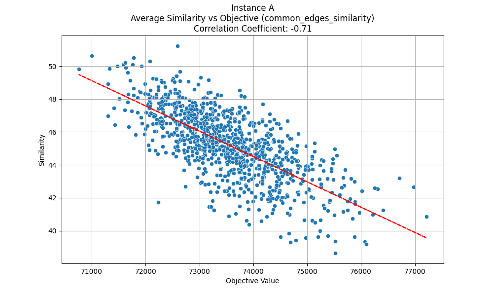
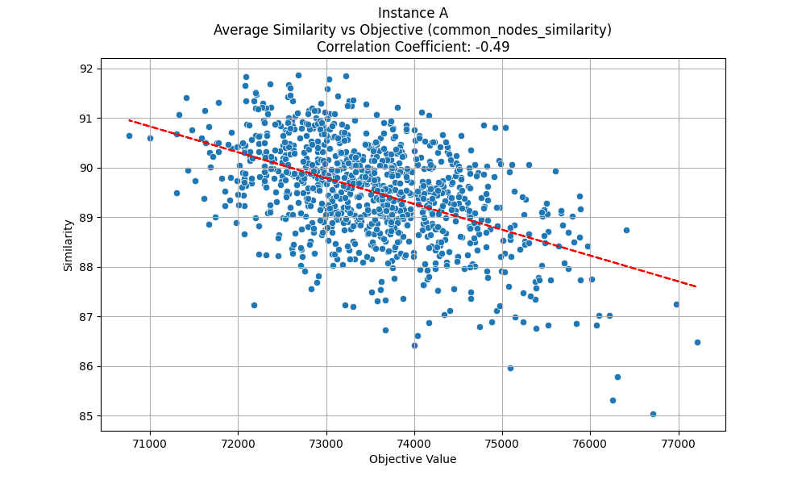
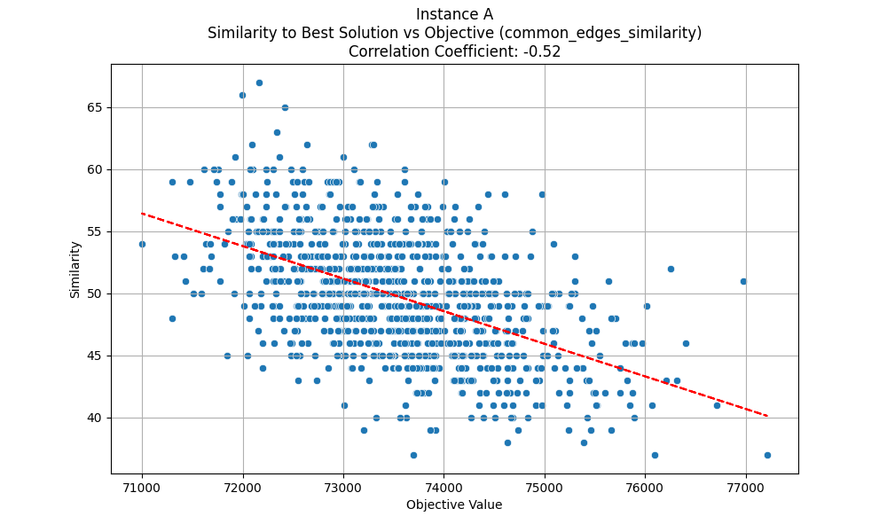
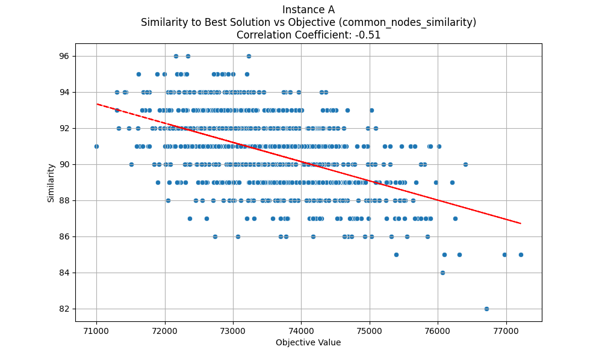
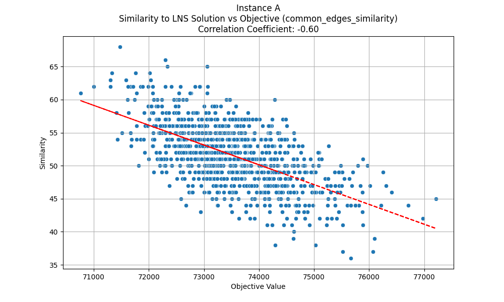
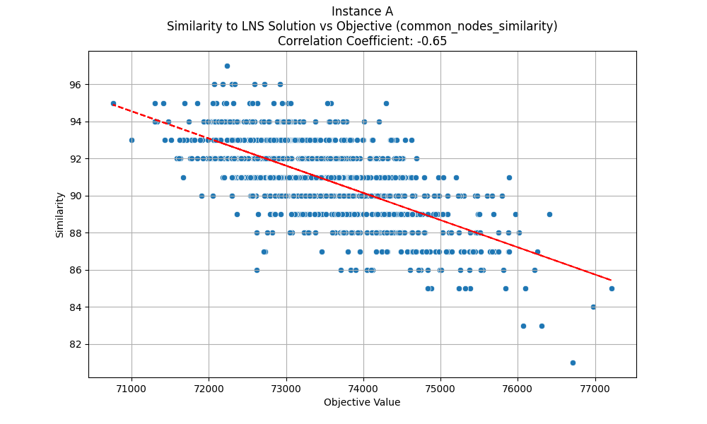

# Instance B
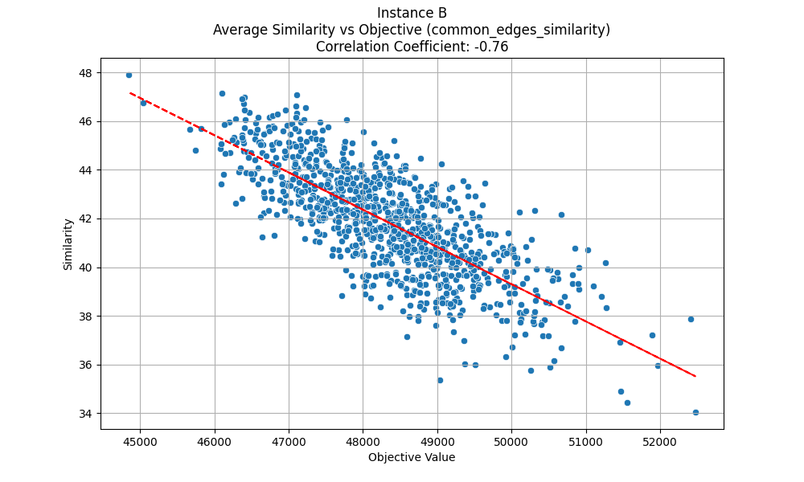
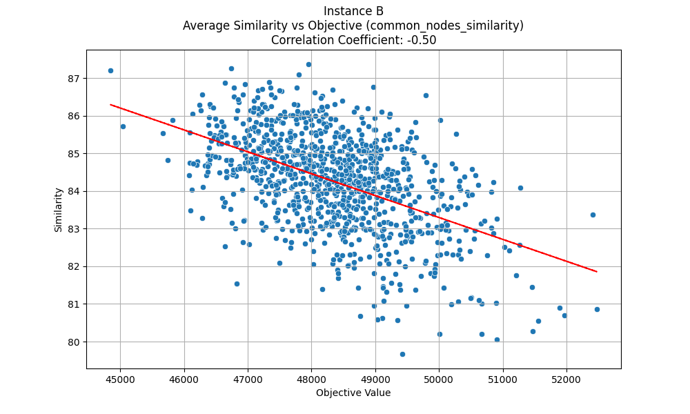
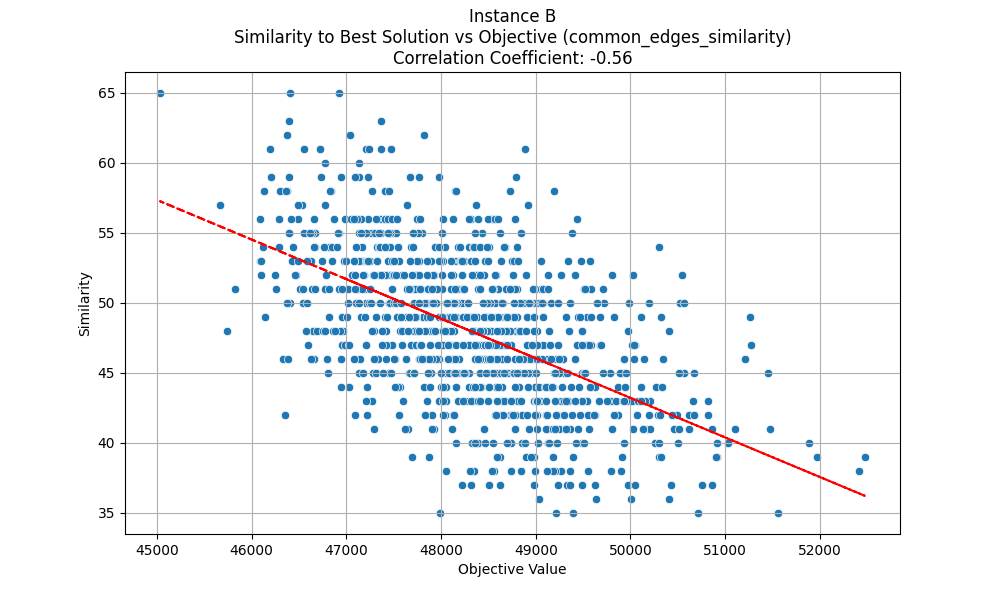
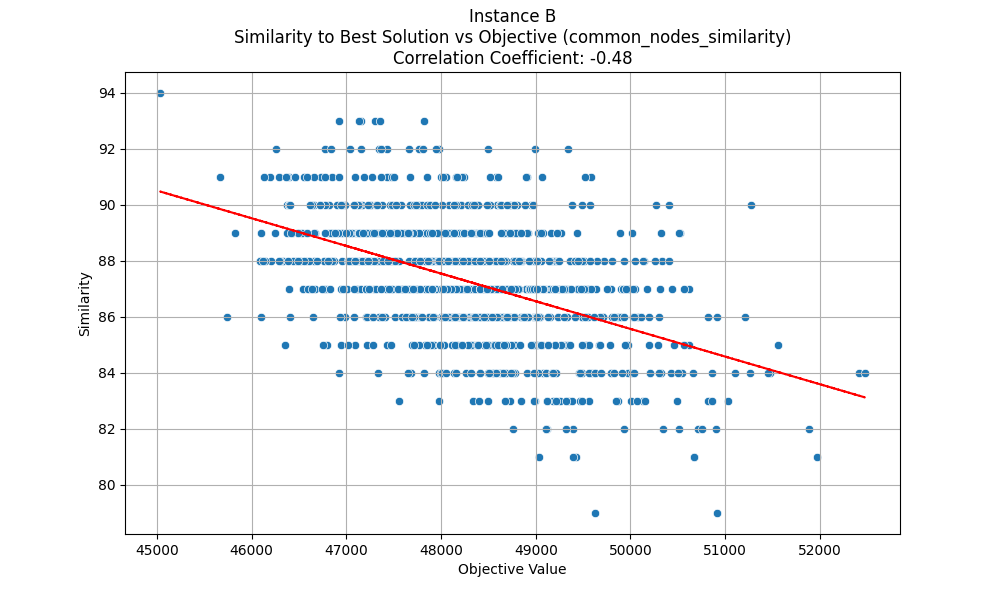
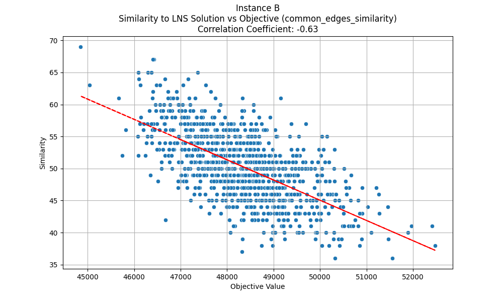
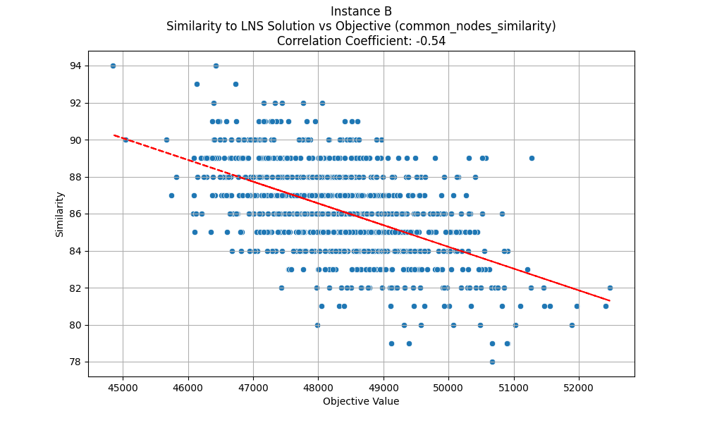