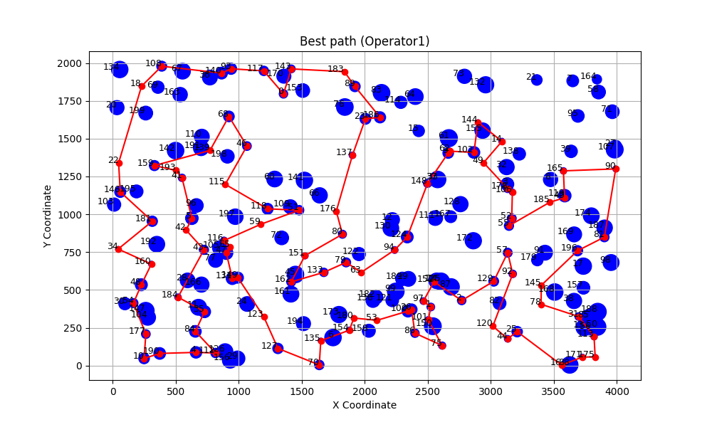
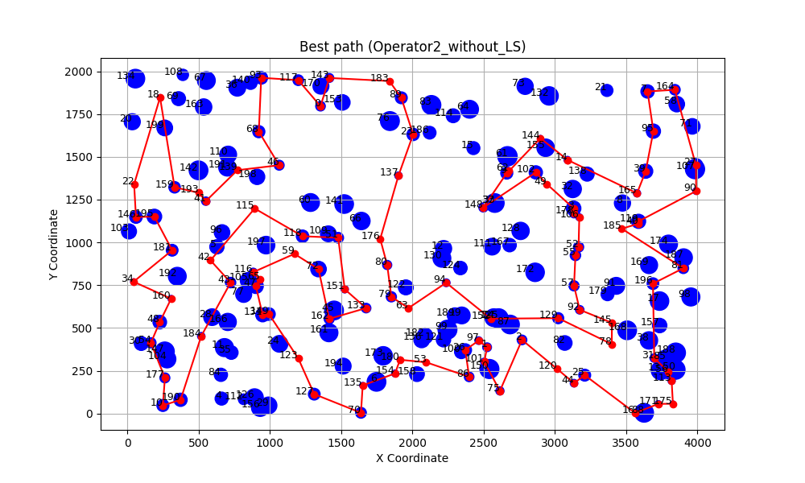
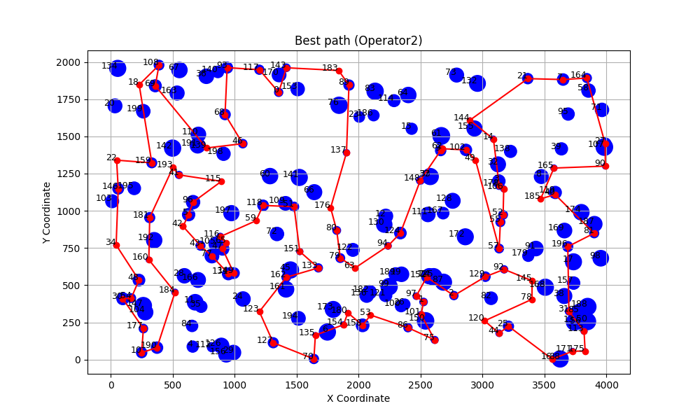
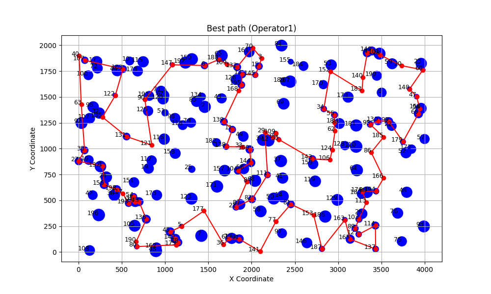
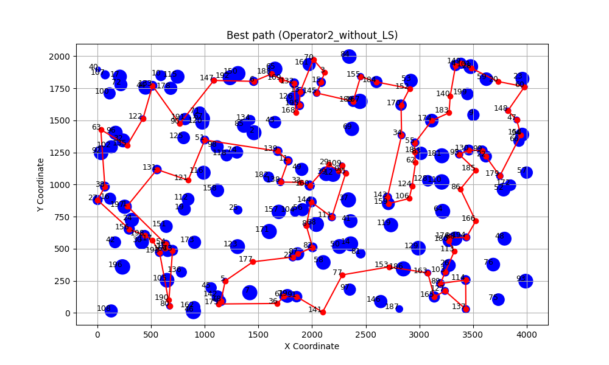
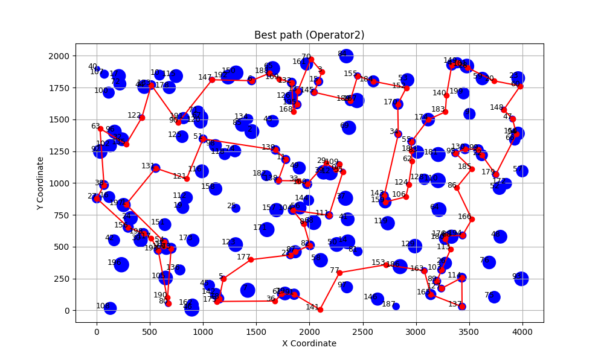

_Link to the source code: [GitHub Repository](https://github.com/wojbog/evolutionary_computation)_

# Authors
- Wojciech Bogacz 156034
- Krzysztof Skrobała 156039


# Problem Description
The problem considered in this project involves a set of nodes, each represented by three
integer values: two coordinates (x,y)(x, y)(x,y) that define the node’s position in a
two-dimensional plane, and a cost value associated with the node. The objective is to select
exactly 50% of all available nodes (if the total number of nodes is odd, the number of
selected nodes is rounded up) and construct a Hamiltonian cycle — that is, a closed path
visiting each selected node exactly once and returning to the starting node.
The goal is to minimize the sum of two components:
1. The total length of the constructed cycle, and
2. The total cost of all selected nodes
The distances between nodes are calculated using the Euclidean metric, rounded to the
nearest integer.

# Implemented Algorithms
```
OPERATOR_1(P1, P2)

Input:
    P1, P2 : parent solutions (tours)

Output:
    Offspring solution

1. Extract edge sets E1 from P1 and E2 from P2
2. Identify common edges E = E1 ∩ E2

3. Initialize empty list of subpaths
4. Mark all nodes as unvisited

5. For each node v in P1 (in tour order):
       If v is unvisited:
           Start new subpath S ← [v]
           Mark v as visited
           While the next edge (v, u) is in E and u is unvisited:
               Append u to S
               Mark u as visited
               v ← u
           Add S to subpaths

6. Let targetSize ← 50% of total nodes
7. While number of selected nodes < targetSize:
       Select a random unvisited node r
       Add subpath [r] to subpaths
       Mark r as visited

8. Randomly shuffle the list of subpaths

9. Initialize empty offspring solution
10. For each subpath S in shuffled order:
        With probability 0.5, reverse S
        Append S to offspring

11. Return offspring
```
```
OPERATOR_2(P1, P2)

Input:
    P1, P2 : parent solutions (tours)

Output:
    Offspring solution

1. Randomly select one parent as base solution B
2. Let O be the other parent

3. Initialize offspring as empty list

4. For each node v in B (in order):
       If v is present in O:
           Append v to offspring

5. Identify removed nodes R:
       R ← nodes in B not present in offspring

6. For each node r in R:
       Insert r into offspring using LNS repair heuristic
       (e.g., cheapest insertion)

7. Return offspring
```
```
Main Loop

1. Initialize population P with 20 solutions
2. Apply local search to each solution
3. Remove duplicate solutions from P

4. While stopping condition not met:

       4.1 Select two parents P1 and P2 uniformly at random from P

       4.2 With probability 0.5:
               Offspring ← OPERATOR_1(P1, P2)
           Else:
               Offspring ← OPERATOR_2(P1, P2)

       4.3 If operator = OPERATOR_2 and LS-disabled variant:
               Skip local search
           Else:
               Apply local search to Offspring

       4.4 If Offspring is duplicate of a solution in P:
               Discard Offspring and continue

       4.5 Insert Offspring into P

       4.6 If |P| > 20:
               Remove worst solution from P

5. Return best solution in P
```


# Results


## Comparison of previous methods results

### Instance A
| Method                        | Best | Worst | Average |
|-------------------------------|:----:|:-----:|:-------:|
| random                        | 235308     | 292123      |  264677.17    |
| nn_end                        | 89198     |  123123     |   104012.785      |
| nn_anywhere                   | 71488     | 74410      |  72635.72    |
| greedy cycle                  | 72639     |  72639     |   72639.0      |
| 2-Regret Insertion            | 105852     | 123428      |  115474.93    |
| Weighted Sum (α=1.00, β=1.00) | 71108     |  73438     |   72130.85      |
|greedy_intra:edges_start:greedy    |70663|72648|71594.055 |
|greedy_intra:edges_start:random    |71564|76328|73528.81  |
|greedy_intra:nodes_start:greedy    |70687|73027|71739.395 |
|greedy_intra:nodes_start:random    |79677|99035|86909.13  |
|steepest_intra:edges_start:greedy  |70510|72614|71463.08  |
|steepest_intra:edges_start:random  |71246|78153|73699.995 |
|steepest_intra:nodes_start:greedy  |70626|73004|71615.93  |
|steepest_intra:nodes_start:random  |81322|95342|87939.335 |
|steepest_intra:edges_start:random  |71246|78153|73699.995 |
|steepest_intra:edges_start:random with Cand mech. |73076 |85487 |77866.91 |
|steepest_lm_intra:edges_start:random|71265 | 78247 | 73856.275|
|ILS_intra:edges_start:random |70901 | 71862 |71303.60|
|steepest_multi_start_intra:edges_start:random| 71149  |  72794 | 71299.05|

### Hybrid evolutionary algorithm

| Method  | best | worst | average|
|----------|----:|:-------:|:---------:|
|Operator1|69875|70843|70518.45|
|Operator2|70154|72087|71630.65|
|Operator2_without_LS|70233|71965|71397.2|


### Hybrid evolutionary algorithm Runs

| Method  | best | worst | average|
|----------|----:|:-------:|:---------:|
|Operator1|703|891|793.35|
|Operator2|10297|18745|12329.00|
|Operator2_without_LS|10245|18921|12637.00|


## Instance B
| Method                        | Best | Worst | Average |
|-------------------------------|:----:|:-----:|:-------:|
| random                        | 193234     | 234798      |  214279.235    |
| nn_end                        | 62606     |  77453     |   69764.43      |
| nn_anywhere                   | 49001     | 57324      |  51400.905    |
| greedy cycle                  | 50243     |  50243     |   50243.0      |
| 2-Regret Insertion            | 66505    | 77072      |  72454.77       |
| Weighted Sum (α=1.00, β=1.00) | 47144     |  55700     |   50918.82      |
|greedy_intra:edges_start:greedy    |46178 | 55471 | 50172.67 |
|greedy_intra:edges_start:random    |45537 | 51687 | 48154.865|
|greedy_intra:nodes_start:greedy    |46373 | 55385 | 50347.525|
|greedy_intra:nodes_start:random    |53417 | 71474 | 61453.295|
|steepest_intra:edges_start:greedy  |45867 | 54814 | 49907.205|
|steepest_intra:edges_start:random  |45903 | 51416 | 48195.845|
|steepest_intra:nodes_start:greedy  |46371 | 55385 | 50201.47 |
|steepest_intra:nodes_start:random  |55686 | 71546 | 62955.885|
|steepest_intra:edges_start:random  |45903 | 51416 | 48195.845|
|steepest_intra:edges_start:random with Cand. Mech. | 45798 | 52670 | 48474.64 |
|steepest_lm_intra:edges_start:random|45941 | 51587 |48214.715 |
|ILS_intra:edges_start:random|45320    |46753   |45463.3|
|steepest_multi_start_intra:edges_start:random|45405    |46222   |45767.4|

### Hybrid evolutionary algorithm

| Method  | best | worst | average|
|----------|----:|:-------:|:---------:|
|Operator1|43924|45040|44757.4|
|Operator2|44244|45547|44894.6|
|Operator2_without_LS|44268|45724|44679.9|

### Hybrid evolutionary algorithm Runs

| Method  | best | worst | average|
|----------|----:|:-------:|:---------:|
|Operator1|656|794|693.57|
|Operator2|8143|20983|12276.98|
|Operator2_without_LS|8167|20872|12561.34|


# Paths visualization
## Instance A

### Operator 1


### Operator 2 without LS 


### Operator 2


## Instance B

### Operator 1


### Operator 2 without LS 


### Operator 2


# Time

## Instance A

| Method  | min | max | average|
|----------|----:|:-------:|:---------:|
|greedy_intra:edges_start:greedy     |0.00  |0.006  |0.003 |
|greedy_intra:edges_start:random     |0.062 |0.099  |0.080 |
|greedy_intra:nodes_start:greedy     |0.000 |0.005  |0.002 |
|greedy_intra:nodes_start:random     |0.066 |0.118  |0.085 |
|steepest_intra:edges_start:greedy   |0.001 |0.005  |0.002 |
|steepest_intra:nodes_start:greedy   |0.000 |0.005  |0.002 |
|steepest_intra:nodes_start:random   |0.049 |0.142  |0.071 |
|steepest_intra:edges_start:random   |0.039 |0.050  |0.045 |
|steepest_intra:edges_start:random with Can. Mech. |0.008 |0.019 |0.011 |
|steepest_lm_intra:edges_start:random|0.025|0.049|0.030|
|ILS_intra:edges_start:random|4.805 | 4.815 | 4.811|
|steepest_multi_start_intra:edges_start:random|4.443|5.99|4.805|

### New Methods Results

| Method  | min | max | average|
|----------|----:|:-------:|:---------:|
|Operator1|-|-|as MSLS|
|Operator2|-|-|as MSLS|
|Operator2_without_LS|-|-|as MSLS|

## Instance B


| Method  | min | max | average|
|----------|----:|:-------:|:---------:|
|greedy_intra:edges_start:greedy     |0.0    |0.01    |0.004|
|greedy_intra:edges_start:random     |0.064  |0.102   |0.081|
|greedy_intra:nodes_start:greedy     |0.0    |0.007   |0.003|
|greedy_intra:nodes_start:random     |0.058  |0.107   |0.082|
|steepest_intra:edges_start:greedy   |0.001  |0.01    |0.004|
|steepest_intra:nodes_start:greedy   |0.001  |0.007   |0.004|
|steepest_intra:nodes_start:random   |0.048  |0.086   |0.063|
|steepest_intra:edges_start:random   |0.038  |0.054   |0.045|
|steepest_intra:edges_start:random with CAn. Mech. | 0.009 |0.05 |0.012 |
|steepest_lm_intra:edges_start:random|0.020|0.053|0.035|
|ILS_intra:edges_start:random| 4.499  |  4.515   |  4.503 |
|steepest_multi_start_intra:edges_start:random|4.377   |  5.077    | 4.498|

| Method  | min | max | average|
|----------|----:|:-------:|:---------:|
|Operator1|-|-|as MSLS|
|Operator2|-|-|as MSLS|
|Operator2_without_LS|-|-|as MSLS|

# Conclusions

- Algorithm with Operator 1 gave better results with compare to operator 2 for both cases.
- Offspring produced by Operator 1 often differ substantially from their parents, leading the algorithm to explore a broader portion of the solution space and increasing the running time of the local search.
